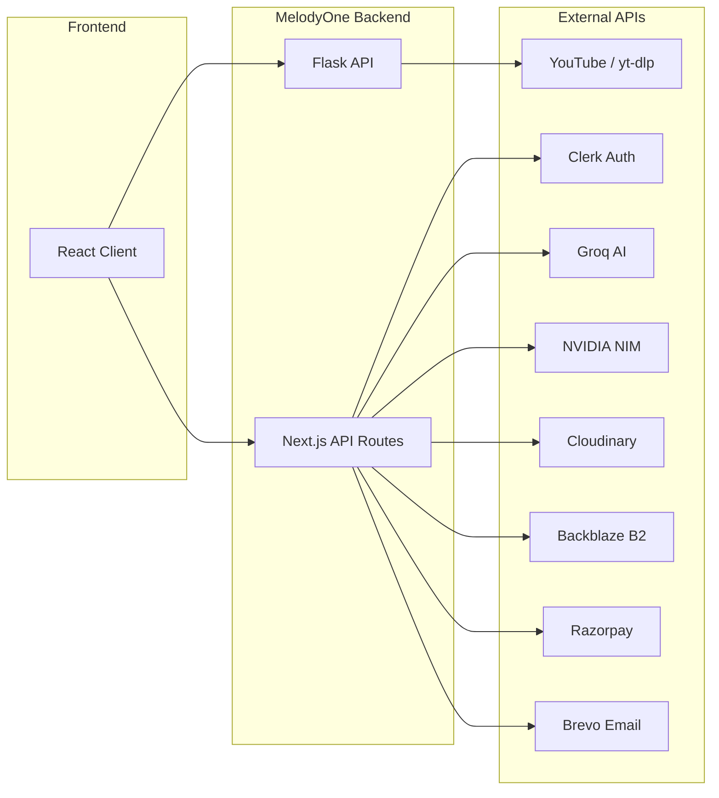

# API Documentation — MelodyOne



## Next.js API Routes (`/api/*`)

### Auth (Clerk Webhooks)
```
POST /api/webhooks/clerk
  → Syncs user data to Neon DB on signup/update/delete
```

### Playlists
```
GET    /api/playlists          → List user's playlists
POST   /api/playlists          → Create playlist
GET    /api/playlists/:id      → Get playlist with tracks
PATCH  /api/playlists/:id      → Update playlist metadata
DELETE /api/playlists/:id      → Delete playlist

POST   /api/playlists/:id/tracks      → Add track
DELETE /api/playlists/:id/tracks/:tid → Remove track
PATCH  /api/playlists/:id/reorder     → Reorder tracks
```

### Favorites
```
GET    /api/favorites          → List user's favorite tracks
POST   /api/favorites          → Add to favorites
DELETE /api/favorites/:id      → Remove from favorites
```

### Search & Stream (Proxied to Flask)
```
GET /api/search?song=NAME
  → Response: { title, artist, stream_url, thumbnail, duration }
```

### AI Chat
```
POST /api/chat
  → Body: { message: string }
  → Response: { reply: string }
  → Uses Groq API (fallback: NVIDIA NIM)
```

### Payments (Razorpay)
```
POST /api/payments/create-order
  → Body: { amount, currency }
  → Response: { orderId, amount, currency }

POST /api/payments/verify
  → Body: { razorpay_order_id, razorpay_payment_id, razorpay_signature }
  → Response: { verified: boolean }
```

### File Uploads
```
POST /api/upload/image
  → Multipart form: file
  → Uploads to Cloudinary → returns { url, publicId }

POST /api/upload/document
  → Multipart form: file
  → Uploads to Backblaze B2 → returns { url, fileId }
```

### Email (Brevo)
```
POST /api/email/send
  → Body: { to, subject, html }
  → Sends transactional email via Brevo
```

## Flask Backend API

### Audio Streaming
```
GET /api/search?song=NAME
  → Uses yt-dlp to fetch best audio stream
  → Response: { title, artist, stream_url, thumbnail, duration }
  → Error: { error: "Gaana nahi mila" }
```

## Rate Limiting

All API routes are rate-limited via Upstash Redis:

| Route | Limit |
|-------|-------|
| `/api/search` | 30 req/min per IP |
| `/api/chat` | 20 req/min per user |
| `/api/playlists` | 60 req/min per user |
| `/api/payments` | 10 req/min per user |
| `/api/upload` | 5 req/min per user |
