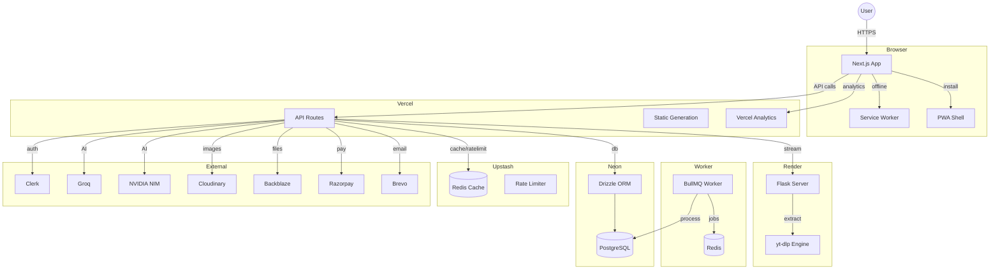

# Architecture — MelodyOne



## Data Flow

### 1. Search & Play
```
User types "Pasoori" → /api/search?song=Pasoori
  → Check Redis cache → HIT → return cached URL
  → MISS → Flask calls yt-dlp → extract audio URL
  → Store in Redis (TTL: 1 hour)
  → Return { title, artist, stream_url, thumbnail }
  → Frontend sets <audio src> → autoPlay
```

### 2. Auth Flow
```
User clicks "Sign In" → Clerk modal
  → Clerk handles OAuth/email
  → Webhook POST /api/webhooks/clerk → sync to Neon
  → Frontend gets session from Clerk
  → Protected routes check authState
```

### 3. Playlist Management
```
User creates playlist → POST /api/playlists
  → Validate session (Clerk)
  → Insert into Neon via Drizzle
  → Return playlist
  → Zustand store updates UI optimistically
```

### 4. AI Chat
```
User sends message → POST /api/chat
  → Rate limit check (Upstash)
  → Call Groq API (primary) or NVIDIA NIM (fallback)
  → Stream response to client
  → Log to DB (optional)
```

## Caching Strategy

| Data | Cache | TTL | Invalidation |
|------|-------|-----|-------------|
| Search results | Upstash Redis | 1 hour | Manual refresh |
| User session | Clerk (built-in) | — | — |
| Playlist data | Next.js ISR | 60s | On mutation |
| Thumbnails | Cloudinary CDN | Permanent | — |
| API responses | Upstash Redis | 5 min | On mutation |

## Security Architecture

```
Client → Next.js → Clerk (JWT session)
  → Helmet headers (XSS, clickjacking, MIME sniffing)
  → CORS (only Vercel domain)
  → CSRF token on mutation endpoints
  → Rate limiter (Upstash sliding window)
  → Input validation (Zod schemas)
  → SQL injection protection (Drizzle parameterized queries)
```

## Error Handling

```
API Layer:
  try → Drizzle query → return data
  catch → log to console → return { error: message }

Flask Layer:
  try → yt-dlp extract → return stream
  catch → return { error: "Gaana nahi mila" }

Frontend:
  API call → loading state → error toast (sonner)
  Network failure → retry 2x → offline fallback
```
