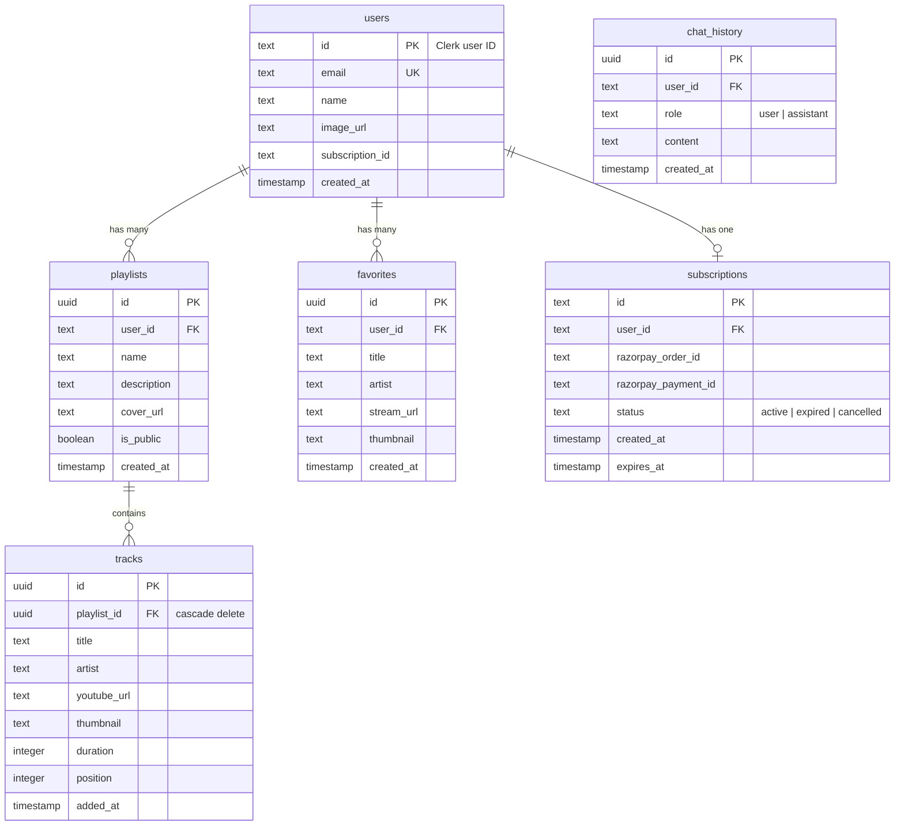

# Database Schema — MelodyOne



## Drizzle Schema

### Users Table
```typescript
export const users = pgTable('users', {
  id: text('id').primaryKey(),
  email: text('email').notNull().unique(),
  name: text('name'),
  imageUrl: text('image_url'),
  subscriptionId: text('subscription_id'),
  createdAt: timestamp('created_at').defaultNow(),
})
```

### Playlists Table
```typescript
export const playlists = pgTable('playlists', {
  id: uuid('id').defaultRandom().primaryKey(),
  userId: text('user_id').references(() => users.id, { onDelete: 'cascade' }),
  name: text('name').notNull(),
  description: text('description'),
  coverUrl: text('cover_url'),
  isPublic: boolean('is_public').default(false),
  createdAt: timestamp('created_at').defaultNow(),
})
```

### Tracks Table
```typescript
export const tracks = pgTable('tracks', {
  id: uuid('id').defaultRandom().primaryKey(),
  playlistId: uuid('playlist_id').references(() => playlists.id, { onDelete: 'cascade' }),
  title: text('title').notNull(),
  artist: text('artist'),
  youtubeUrl: text('youtube_url'),
  thumbnail: text('thumbnail'),
  duration: integer('duration'),
  position: integer('position').notNull(),
  addedAt: timestamp('added_at').defaultNow(),
})
```

### Favorites Table
```typescript
export const favorites = pgTable('favorites', {
  id: uuid('id').defaultRandom().primaryKey(),
  userId: text('user_id').references(() => users.id, { onDelete: 'cascade' }),
  title: text('title').notNull(),
  artist: text('artist'),
  streamUrl: text('stream_url'),
  thumbnail: text('thumbnail'),
  createdAt: timestamp('created_at').defaultNow(),
})
```

### Subscriptions Table
```typescript
export const subscriptions = pgTable('subscriptions', {
  id: uuid('id').defaultRandom().primaryKey(),
  userId: text('user_id').references(() => users.id, { onDelete: 'cascade' }),
  razorpayOrderId: text('razorpay_order_id'),
  razorpayPaymentId: text('razorpay_payment_id'),
  status: text('status').default('active'),
  createdAt: timestamp('created_at').defaultNow(),
  expiresAt: timestamp('expires_at'),
})
```

## Indexes

```typescript
export const userIdIndex = index('user_id_idx').on(favorites.userId)
export const playlistUserIndex = index('playlist_user_idx').on(playlists.userId)
export const trackPositionIndex = index('track_position_idx').on(tracks.playlistId, tracks.position)
```

## Neon Connection

```typescript
// lib/db/index.ts
import { neon } from '@neondatabase/serverless'
import { drizzle } from 'drizzle-orm/neon-http'

const sql = neon(process.env.DATABASE_URL!)
export const db = drizzle(sql)
```
