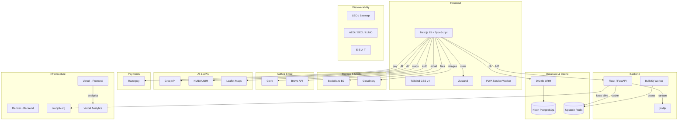

# Tech Stack — MelodyOne

## Frontend

| Library | Version | Purpose |
|---------|---------|---------|
| Next.js | ^15.0 | React framework (App Router) |
| TypeScript | ^5.6 | Type safety |
| Tailwind CSS | ^4.0 | Utility-first styling |
| Zustand | ^5.0 | Client state management |
| Clerk | latest | Authentication |
| @upstash/redis | latest | Redis client |
| drizzle-orm | latest | ORM |
| @neondatabase/serverless | latest | PG driver |
| next-pwa | latest | PWA support |
| razorpay | latest | Payments |
| leaflet | latest | Maps |
| @vercel/analytics | latest | Analytics |

## Backend

| Library | Purpose |
|---------|---------|
| Flask / FastAPI | HTTP server for yt-dlp |
| yt-dlp | YouTube audio extraction |
| bullmq | Job queue |
| ioredis | Redis client for worker |

## Infrastructure

| Service | Purpose | Cost |
|---------|---------|------|
| Vercel | Frontend hosting | Free tier |
| Render | Backend hosting | Free tier |
| Neon | PostgreSQL | Free tier |
| Upstash | Redis | Free tier |
| Backblaze B2 | File storage | Free 10GB |
| Cloudinary | Image CDN | Free tier |
| Clerk | Auth | Free tier |
| Brevo | Email | Free 300/day |
| Razorpay | Payments | Per transaction |
| cronjob.org | Uptime pings | Free |
