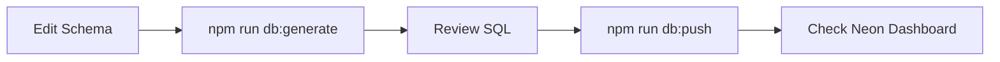

# Development Workflow — MelodyOne

```mermaid
flowchart TB
  subgraph Daily Dev
    START((Start)) --> BRANCH[Create Feature Branch]
    BRANCH --> CODE[Write Code]
    CODE --> TEST[Run Tests]
    TEST --> LINT[npm run lint --fix]
    LINT --> TYPECHECK[npm run typecheck]
    TYPECHECK --> COMMIT[Commit]
  end

  subgraph PR
    COMMIT --> PR[Open PR]
    PR --> REVIEW[Code Review]
    REVIEW --> MERGE[Merge to Main]
  end

  subgraph Deploy
    MERGE --> BUILD[Build]
    BUILD --> VERIFY[Vercel Preview]
    VERIFY --> PROD[Deploy to Production]
  end

  PROD --> MONITOR[Check Analytics + Logs]
  MONITOR --> START
```

## 1. Branch Strategy

```
main          → Production-ready code
develop       → Integration branch
feature/xxx   → New features (branch from develop)
fix/xxx       → Bug fixes (branch from develop)
release/x.x   → Release candidates
```

## 2. Commit Convention

```
type(scope): description

Types: feat, fix, chore, docs, style, refactor, perf, test
Scope: api, db, player, auth, ui, chat, deploy

Examples:
  feat(player): add seek bar with purple-600 slider
  fix(api): handle yt-dlp timeout gracefully
  docs(deploy): add Vercel env vars to DEPLOYMENT.md
```

## 3. Code Review Checklist

- [ ] TypeScript compiles (no errors, no `any`)
- [ ] Tests pass (npm run test)
- [ ] No console.log / debugger statements
- [ ] API keys in env vars (not hardcoded)
- [ ] Edge cases handled (see EDGE_CASES.md)
- [ ] Mobile responsive (check Tailwind breakpoints)
- [ ] PWA works (Lighthouse PWA audit)
- [ ] Rate limiting applied on API routes
- [ ] No SQL injection (Drizzle parameterized queries)
- [ ] CSRF protection on mutation endpoints

## 4. Testing Flow

```mermaid
flowchart LR
  subgraph Unit
    VT[Vitest]
    RTL[React Testing Library]
  end

  subgraph Integration
    API[API Route Tests]
    DB[Database Tests]
  end

  subgraph E2E
    PW[Playwright]
  end

  subgrade Performance
    LH[Lighthouse CI]
    PS[PageSpeed Insights]
  end

  VT --> API
  RTL --> PW
  DB --> PW
  PW --> LH
  LH --> PS
```

## 5. Database Migration Flow



## 6. Deployment Flow

### Frontend (Vercel)
```bash
git push origin main
  → Vercel auto-deploys
  → Preview on PR (preview URL)
  → Production on main
```

### Backend (Render)
```bash
git push origin main
  → Render auto-deploys
  → Health check: /health
  → cronjob.org pings every 10 min
```

## 7. Daily Checklist

- [ ] `git pull origin main` — sync latest
- [ ] `npm run typecheck` — no TS errors
- [ ] `npm run lint --fix` — clean code
- [ ] Work on one task at a time
- [ ] Commit after each working task
- [ ] PR before end of day if feature complete
