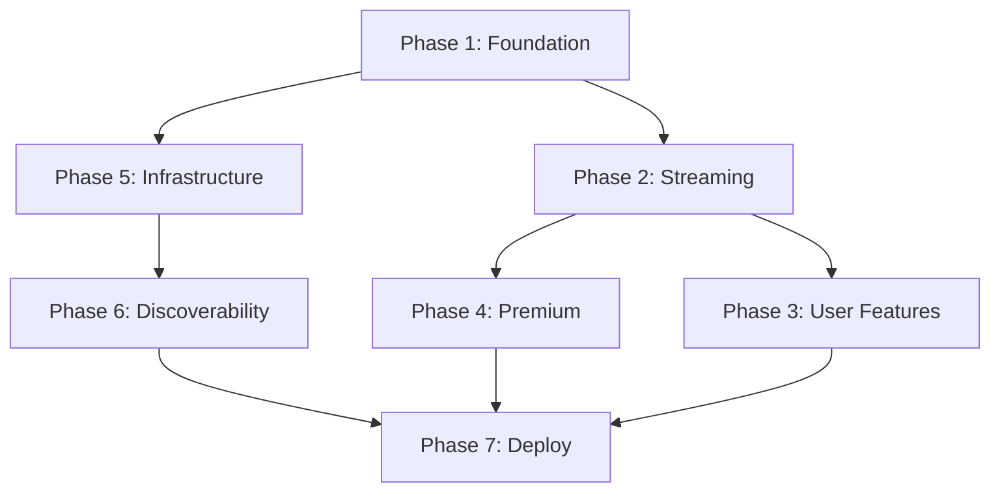

# Implementation Plan — MelodyOne

## Phases Overview

```
Phase 1: Foundation (Scaffold + DB + Auth)
Phase 2: Core Streaming (YouTube search + Player)
Phase 3: User Features (Playlists + Favorites)
Phase 4: Premium Features (AI Chat + Payments + Uploads)
Phase 5: Infrastructure (Cache + Queue + Security)
Phase 6: Discoverability (SEO + PWA + Docs)
Phase 7: Deploy (Vercel + Render + cronjob)
```

## Architecture Decisions

1. **Monorepo** — `frontend/` (Next.js) + `backend/` (Flask) in same repo
2. **Flask stays** — Current `run.py` + `engine.py` handle yt-dlp streaming
3. **Next.js App Router** — API routes for all non-streaming endpoints
4. **All new code in `src/`** — Clean Next.js 15 structure
5. **Zustand for client state** — No Redux, no Context for player state
6. **Drizzle for DB** — Type-safe, no Prisma overhead

## Dependencies



## Risk Assessment

| Risk | Mitigation |
|------|-----------|
| yt-dlp breaks (YouTube changes) | Error handling + fallback messages |
| Clerk migration complexity | Use Clerk's built-in components first |
| Neon free tier limits | Connection pooling + query optimization |
| Render free tier sleeps | cronjob.org keep-alive |
| Rate limiting false positives | Sliding window + whitelist for premium users |
